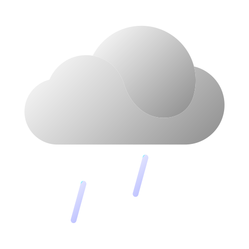

# 天气图标

这是一个天气图标的项目，使用Adobe Illustrator设计了68个渐变风格的图标，覆盖了[高德地图的天气代码](https://www.freecodecamp.org/news/how-to-write-a-good-readme-file/)。这些图标可以用于显示不同的天气状况，适用于网页、应用或其他媒体。

## 安装和使用

要使用这些图标，你需要安装Adobe Illustrator软件，可以从[官网](https://dev.to/mfts/how-to-write-a-perfect-readme-for-your-github-project-59f2)下载试用版或购买正版。你也可以使用其他支持svg格式的软件打开和编辑这些图标。

这些图标都保存在 `ai`文件夹中，每个图标都有对应的svg文件放在 `svg`文件夹中，你可以直接在浏览器中查看或嵌入到你的网页中。

你也可以使用Adobe Illustrator打开.ai工程文件进行编辑

## 示例

下面是一些图标的示例，展示了不同的天气状况的效果。

| 晴                 | 阴                | 小雨                  | 霾                |
| ------------------ | ----------------- | --------------------- | ----------------- |
|  |  |  |  |

## 许可证

这个项目使用[Mozilla Public License 2.0](./LICENSE)协议。
